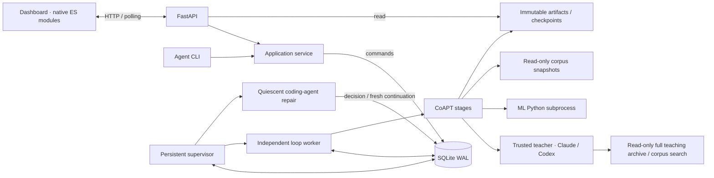

# Architecture

The control plane, worker, ML runtime, and dashboard are separate. The web server reads
records and queues actions. The worker owns the loop and model processes. SQLite and
immutable artifacts are the interface between them.

## File boundaries

| Location | Responsibility |
| --- | --- |
| `config.py` | Validated recipes, machine settings, stage names, pinned local model resolution. |
| `storage.py` | SQLite schema and transactional reads/writes. No model or UI logic. |
| `artifacts.py` | Canonical serialization, atomic files, content hashes, checkpoint verification. |
| `service.py` | Campaign creation, action validation, bounded dashboard snapshots, worker launch. |
| `api.py` / `cli.py` | Thin transport interfaces over the same application operations. |
| `supervisor.py` | Durable scheduling, provider retry timers, child process launch. |
| `recovery.py` | Separate coding-agent role, repair attempts, checks, structured decisions. |
| `ownership.py` | Shared training / exclusive repair source lock and source fingerprint. |
| `worker.py` | Workspace ownership, command consumption, orphan cleanup, pause/stop signals. |
| `engine.py` | Stage attempts, input fingerprints, completion, checkpoint chaining. |
| `stages.py` | Text CoAPT operations and the explicit flow of learning data. |
| `corpus.py` | Paginated corpus discovery and exact teacher-selected verified source spans. |
| `teaching.py` | Teacher-owned curriculum, revision, assessment and reflection contracts. |
| `teacher_tools.py` | Read-only access to all campaigns, rounds, records, metrics, artifacts and corpus. |
| `processes.py` | Owned process groups, timeouts, cancellation, incremental output. |
| `providers/base.py` | Teacher, student and trainer contracts. |
| `providers/teacher.py` | Tool-enabled CLI transport, teaching handbook/context, decision schemas and usage ledger. |
| `providers/local.py` | JSON transport to the ML environment. |
| `training.py` | Pure tokenizer-based mixture planning, token accumulation, optimizer recipe identity. |
| `workers/model.py` | Actual Transformers inference, PyTorch optimization and optimizer persistence. |
| `prompts/*.txt` | Reviewed teacher instructions; hashed into stage provenance. |
| `dashboard/dist/` | Authored static HTML/CSS and ES modules; no build tool required. |

The dashboard's `app.js` owns navigation and polling, `views.js` renders the records, and
`lib.js` contains pure formatting, diff, and chart functions. Text from models and sources
is escaped before rendering. There are no provider calls from the browser. The Nordic
palette and layout use shared CSS tokens. A framework can replace this surface later
without changing the worker contracts.

## Durable execution

`campaigns` holds the immutable requested recipe and campaign lifecycle. `rounds` records
checkpoint lineage. `stage_runs` identifies individual attempts and their input/output
hashes. `records` holds lesson/evaluation/gap projections for the UI. `metrics` contains
optimizer measurements, separate from the bounded `events` feed. `actions` is the durable
control queue; `teacher_calls` records call status and available provider usage. Schema v2
adds durable `recoveries`, continuation/context links and the teacher allowance epoch.
Migrations serialize across process startup. Incident resolution and continuation/start
creation commit atomically, so scheduler restarts cannot lose the queued follow-up.

A stage completes by writing and renaming its immutable artifact first, then committing
the artifact digest and completion event in one SQLite transaction. Orphan artifacts are
harmless; an attempt without a completion record is retried. Partial projections and
metrics are observable but do not mean the stage completed.

On resume, completed artifacts and their input fingerprints are checked. The first
unfinished stage gets a fresh attempt directory. A trained checkpoint is accepted only
after its manifest and file hashes verify. The next round starts from that checkpoint.
No independent benchmark is needed or consulted.

The worker owns an OS file lock for the workspace, with PID and process-start identity
recorded for inspection. The OS releases the lock after a crash. On recovery, recorded
child identities are checked before terminating orphan process groups; unfinished stages
become interrupted. In-flight campaigns wake recovery when enabled; previously queued
start actions remain operator requests and can be consumed. The supervisor runs separately
from short-lived workers and repair drivers, and reloads itself after source changes.

Pause is cooperative at stage boundaries. Stop cancels the owned process group with
TERM, then KILL after a bounded grace period. Restarting the API does not kill the worker.
Subprocess logs remain in the workspace; stdout JSON messages update actual generations
and metrics while the process runs.

## Evidence and evaluation

The corpus SQLite index is only a candidate lookup. Manifest entries, current eligibility,
and matching cleaned-document hashes decide admission. Read-only snapshots tolerate an
active corpus grower; eligibility must remain unchanged throughout selection. The teacher selects
sources and spans; a configured prefix is only an initial search suggestion. The index has
no fixed frontier cutoff. Admission still checks the authoritative manifest and content hash.

The teacher is the teaching authority. The teacher selects exact
training text and whether each lesson should be used. The historical `gate` stage records
that inclusion/omission decision after schema and ID checks for artifact/UI compatibility. There is no second semantic gate. Grading returns `needs_practice` and
`priority`; adaptation uses those decisions without imposing a score threshold.

Freeze runs the student's tokenizer in the ML subprocess and preserves exact input IDs,
provenance and a token ledger. Teacher-selected rows, including intentional duplicates, are used once per chosen pass;
source and review targets fill the teacher’s shares. A missing teacher stream is valid for
reading/review-only rounds; empty datasets or teacher-selected `train_epochs=0` produce an
explicit unchanged-checkpoint artifact. Prepared samples can remain available in a diagnostic
round without being consumed by training. Samples overlap one conditioning token at chunk
boundaries to preserve causal target counts, without joining unrelated examples. Accumulation
weights each loss by actual target tokens. FP32 weights, Adam moments, global update/token
counters and recipe/code hashes are saved and checked at completed round boundaries.
Partial attempts remain inspectable but retries restart from the parent state. This is
cross-round optimizer continuity, not arbitrary mid-stage resume or identical RNG replay.

Each teacher call includes the local CoAPT handbook, current task and latest durable
teaching notes. The teacher has file/search tools and a read-only helper with access to
all campaigns, lineage, rounds, student attempts, teacher outputs, evaluations, metrics,
stage artifacts and corpus sources. No recency window limits access. Responses are paged,
and the teacher decides which pages or searches to request. The worker keeps a SQLite
connection open during the call so read-only tools can read existing WAL sidecars.

Teacher-owned decisions replace fixed source ranking, alternating task types, prompt
prefix insertion, question counts and automatic recent-lesson replay. Exact training_text
is stored with the lesson and used verbatim. Legacy replay uses the original serialization.
The teacher may author its own examples and synthesize across sources. An absent source
is represented explicitly, never by an invented corpus hash.

Online references/rubrics are committed before inference. Only the teacher's exact
student_prompt is sent to inference; hidden scoring fields are never appended. The teacher
can design context-assisted tasks, revisit old questions or defer assessment. Its judgments
and priorities are authoritative. Reflection writes durable notes and next instructions,
then chooses continue, pause through the command queue, or campaign completion. Changing
online scores remain diagnostics, not a fixed benchmark trend.

## Scope and design review

Architecture discussed with Claude Code Fable 5.1. Adopted recommendations include the
independent worker, durable command queue, first-class stage attempts, artifacts-before-DB
completion, isolated metrics, explicit provider contracts, and separate prompt files.

The first version deliberately keeps the agreed QA-as-text branch alongside prose, uses
online evaluation rather than introducing a benchmark gate, and preserves checkpoints
rather than automatically deleting training evidence. No distributed scheduler, generic
workflow DSL, cloud GPU transport, or plugin discovery mechanism is needed for this scope.

SQLite is the local persistence boundary; it is not a multi-machine queue. Model execution
is sequential. Expensive operations stay out of request handlers. The dashboard polls
bounded snapshots every two seconds and pauses polling when hidden. A future SSE transport
can reuse the monotonically increasing event IDs without changing the engine.

Remote access uses an explicit Tailscale bind address and hostname allowlist. Local-only
binding remains the CLI default. The deployed dashboard runs as a user service; its unit
preserves the independent learning worker across API restarts. See `deploy/README.md`.

## Recovery boundaries

Normal teacher quota/rate waits use deterministic timers; they do not need a coding-agent
call. Other faults wake the independently configured orchestrator (Codex or Claude Code).
The worker releases its shared source lock before the agent acquires an exclusive lock.
The agent can inspect logs and repair this repository, but cannot operate neighboring
repos, alter training artifacts, launch training, or recursively start repair agents.

Agent output is a strict retry/wait/continue/pause decision with allowlisted recipe changes.
Source and teacher-handbook changes trigger Python integration tests. The handbook is
included in execution fingerprints and failed-patch backup/restore. A separate fresh interpreter applies the
decision through the durable queue. Fingerprint changes create a new campaign with the
latest verified checkpoint and bounded teaching context. Changed optimizer recipes/training
code record an explicit first-round optimizer reset; unchanged recipes preserve state.

Pause/stop cancel recovery, including its recorded child process. Repeated repair failures
are bounded; missing credentials, inaccessible dependencies, broken control-plane imports,
or exhausted disk can still need operator work. Automatic repair is not guaranteed.
All checkpoints are retained; continuous execution does not imply unlimited storage.
