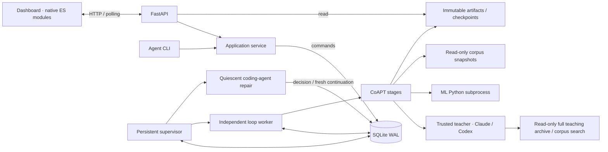

# Architecture

The control plane, worker, ML runtime, and dashboard are separate. The web server reads
records and queues actions. The worker owns the loop and model processes. SQLite and
immutable artifacts are the interface between them.

The implemented training path is **CoAPT Mid-training**, the project's unified CPT + SFT
loop. CPT/SFT labels describe recipe materials and provenance inside that path. **CoAPT
Post-training** groups the planned RL + OPD mechanisms; it is outside the current
implementation scope. The naming contract lives in [docs/COAPT.md](docs/COAPT.md).

## File boundaries

| Location | Responsibility |
| --- | --- |
| `config.py` | Validated recipes, machine settings, stage names, pinned local model resolution. |
| `storage.py` | SQLite schema and transactional reads/writes. No model or UI logic. |
| `artifacts.py` | Canonical serialization, atomic files, content hashes, checkpoint verification. |
| `service.py` | Campaign creation, action validation, bounded dashboard snapshots, worker launch. |
| `api.py` / `cli.py` | Thin transport interfaces over the same application operations. |
| `supervisor.py` | Durable scheduling, provider retry timers, child process launch. |
| `recovery.py` | Separate coding-agent role, repair attempts, checks, structured decisions. |
| `telemetry.py` | Read-only lineage duration and cumulative measured teacher/training token series. |
| `reports.py` | Read-only report catalog, current observations and all decision/check/outcome evidence for UI and orchestrator. |
| `history.py` | Run/log inventory, orchestrator retention decisions, recoverable cleanup and restore. |
| `ownership.py` | Shared training / exclusive repair source lock and source fingerprint. |
| `worker.py` | Workspace ownership, command consumption, orphan cleanup, pause/stop signals. |
| `engine.py` | Stage attempts, input fingerprints, completion, checkpoint chaining. |
| `stages.py` | CoAPT Mid-training operations and the explicit flow of learning data. |
| `corpus.py` | Paginated corpus discovery and exact teacher-selected verified source spans. |
| `teaching.py` | Teacher-owned curriculum, revision, assessment and reflection contracts. |
| `teacher_tools.py` | Read-only access to all campaigns, rounds, records, metrics, artifacts and corpus. |
| `processes.py` | Owned process groups, timeouts, cancellation, incremental output. |
| `providers/base.py` | Teacher, student and trainer contracts. |
| `providers/teacher.py` | Tool-enabled CLI transport, teaching handbook/context, decision schemas and usage ledger. |
| `providers/local.py` | JSON transport to the ML environment. |
| `training.py` | Pure tokenizer-based mixture planning, token accumulation, optimizer recipe identity. |
| `workers/model.py` | Actual Transformers inference, PyTorch optimization and optimizer persistence. |
| `workers/generation.py` | Active bounded FP32 batch inference, per-answer audits and shared batch provenance. The legacy model entrypoint remains preserved for training compatibility. |
| `work_accounting.py` | Prepared dose, material utilization and completed shared inference accounting; no curriculum or recovery decisions. |
| `prompts/*.txt` | Reviewed teacher instructions; hashed into stage provenance. |
| `dashboard/dist/` | Authored static HTML/CSS and ES modules; asset versions stamped for release. |

The dashboard's `app.js` owns navigation and polling, `views.js` renders the records, and
`lib.js` contains pure formatting, diff, and chart functions. Text from models and sources
is escaped before rendering. There are no provider calls from the browser. The Nordic
palette and layout use shared CSS tokens. A framework can replace this surface later
without changing the worker contracts. After editing static files, run
`cd dashboard && npm run release`. The Node script hashes the normalized HTML, CSS
and JavaScript and stamps the same release version into HTML asset URLs and every
local module import. Re-running it is idempotent. This prevents fresh HTML/modules
from reusing a cached stylesheet or nested module from another release. Fonts and
images are unchanged assets; this is not a bundler or a service worker. An already
open page picks up a release on refresh.

## Durable execution

`campaigns` holds the immutable requested recipe and campaign lifecycle. `rounds` records
checkpoint lineage. `stage_runs` identifies individual attempts and their input/output
hashes. `records` holds lesson/evaluation/gap projections for the UI. `metrics` contains
optimizer measurements, separate from the bounded `events` feed. `actions` is the durable
control queue; `teacher_calls` records call status and available provider usage. Schema v2
adds durable `recoveries`, continuation/context links and the teacher allowance epoch.
Schema v3 adds run retention, log-cleanup journals and history-review scheduling.
Schema v4 records each command's actor/reason and an independent `operator_hold`.
Only explicit user pause/stop sets that hold; user start/resume/review releases it.
Legacy pause/stop provenance is ambiguous and is conservatively migrated as a hold.
`review <campaign_id> --reason ...` releases a hold into the command queue for an
orchestrator decision without directly launching another teaching round.
Migrations serialize across process startup. Incident resolution and continuation/start
creation commit atomically, so scheduler restarts cannot lose the queued follow-up.
An accepted review supersedes an older running recovery decision. The repair may finish
its checks and preserve its report, but retry, continuation and cooldown application
recheck the recovery's status transactionally. Workers discard stale start/resume commands
when a review or recovery handoff is pending, including queues saved by older versions.

A stage completes by writing and renaming its immutable artifact first, then committing
the artifact digest and completion event in one SQLite transaction. Orphan artifacts are
harmless; an attempt without a completion record is retried. Partial projections and
metrics are observable but do not mean the stage completed.

On resume, completed artifacts and their input fingerprints are checked. The first
unfinished stage gets a fresh attempt directory. A trained checkpoint is accepted only
after its manifest and file hashes verify. The next round starts from that checkpoint.
No independent benchmark is needed or consulted.

The worker owns an OS file lock for the workspace, with PID and process-start identity
recorded for inspection. The OS releases the lock after a crash. On recovery, recorded
child identities are checked before terminating orphan process groups; unfinished stages
become interrupted. In-flight campaigns wake recovery when enabled; previously queued
start actions remain operator requests and can be consumed. The supervisor runs separately
from short-lived workers and repair drivers, and reloads itself after source changes.

Pause is cooperative at stage boundaries. Stop cancels the owned process group with
TERM, then KILL after a bounded grace period. Restarting the API does not kill the worker.
Subprocess logs remain in the workspace; stdout JSON messages update actual generations
and metrics while the process runs.

At quiescence the supervisor reconciles unscheduled interruptions, including teacher
pauses, failed/stopped workers and missing recovery handoffs. It creates one durable
status-review incident with the prior status, command actor and reason; it never decides
whether to resume training. Existing recovery timers/budgets, explicit operator holds,
disabled automatic recovery, completed/unstarted campaigns and superseded parents are
preserved. Reconciliation and incident creation are transactional, so restart or a
concurrent user pause cannot lose the handoff or override the user's hold. Routine
history reviews still yield only at completed-round boundaries.

## Evidence and evaluation

The corpus SQLite index is only a candidate lookup. Manifest entries, current eligibility,
and matching cleaned-document hashes decide admission. Read-only snapshots tolerate an
active corpus grower; eligibility must remain unchanged throughout selection. The teacher selects
sources and spans; a configured prefix is only an initial search suggestion. The index has
no fixed frontier cutoff. Admission still checks the authoritative manifest and content hash.

The teacher is the teaching authority. The teacher selects exact
training text and whether each lesson should be used. The historical `gate` stage records
that inclusion/omission decision after schema and ID checks for artifact/UI compatibility. There is no second semantic gate. Grading returns `needs_practice` and
`priority`; adaptation uses those decisions without imposing a score threshold.

CoAPT Mid-training uses one full-sequence causal-LM trainer for its recipe materials.
The `cpt` and `sft` lesson kinds both feed the teacher stream; corpus and replay supply
the other token shares. These identifiers remain stable in schemas and saved artifacts.
Freeze runs the student's tokenizer in the ML subprocess and preserves exact input IDs,
provenance and a token ledger. Teacher-selected rows, including intentional duplicates,
are used once per chosen pass; source and review targets fill the teacher’s shares.

Revision `training_tokenization=prompt_prefix` optionally encodes the exact student prompt
and remaining training-text suffix separately, avoiding cross-boundary BPE merges. The
default `full_text` and legacy replay retain whole-text tokenization. This choice and the
prefix are frozen in row provenance and preserved on replay; text and full-sequence loss
are unchanged. Opt-in requires an exact nonempty character prefix, but imposes no template
or educational gate. Chunking can still split a prefix across samples.

Campaign `student_format` defaults to legacy `raw_text`; `chat_template` applies the
checkpoint's native single-user-message, no-thinking generation template. Lessons and
assessment items may override it. Oversized chat prompts fail instead of truncating the
assistant header. Revision `chat_response` freezes the exact generation-prefix IDs,
separately encoded assistant response and template-derived closing IDs through effective
EOS. Full-sequence loss remains unchanged. Serialization code is part of the training
compatibility hash. Replay preserves content/mode and checks recorded chat-template hashes;
raw replay is retokenized by the current tokenizer, including its BOS policy. Historical
comparisons preserve each side's saved interface and label checkpoint-and-interface
provenance; they do not isolate a weights-only effect.

A missing teacher stream is valid for reading/review-only rounds; empty datasets or
teacher-selected `train_epochs=0` produce an
explicit unchanged-checkpoint artifact. Prepared samples can remain available in a diagnostic
round without being consumed by training. Samples overlap one conditioning token at chunk
boundaries to preserve causal target counts, without joining unrelated examples. Accumulation
weights each loss by actual target tokens. FP32 weights, Adam moments, global update/token
counters and recipe/code hashes are saved and checked at completed round boundaries.
Partial attempts remain inspectable but retries restart from the parent state. This is
cross-round optimizer continuity, not arbitrary mid-stage resume or identical RNG replay.

An explicit orchestrator continuation may select `restore_base_from_round` together with
`inherit_optimizer=false`. This one-use recovery option resolves the completed historical
round's input through its immutable training-parent provenance and verified pinned cache
snapshot. It accepts no arbitrary path. The current campaign remains the teaching/history
parent; the continuation context and event record the selected Base file hashes, original
training artifact, retained checkpoint and recovery reason. Worker entry revalidates this
identity before using Base, including retries and diagnostic-only rounds. Subsequent trained
checkpoints follow ordinary lineage and optimizer rules. This is a bounded orchestrator
experiment, never an automatic learning-score gate. Historical output-checkpoint restoration
is not implemented by this option. An in-flight repair driver retains its original decision
schema; introducing an option may require a short scheduled review with a fresh driver after
host validation, before that option can be selected.

Each teacher call includes the local CoAPT handbook, current task and latest durable
teaching notes. The teacher has file/search tools and a read-only helper with access to
all campaigns, lineage, rounds, student attempts, teacher outputs, evaluations, metrics,
stage artifacts and corpus sources. No recency window limits access. Responses are paged,
and the teacher decides which pages or searches to request. The worker keeps a SQLite
connection open during the call so read-only tools can read existing WAL sidecars.

Teacher requests that exceed the inline transport budget store their complete recorded
data in the call directory's `recorded-data.json`. The prompt retains the handbook,
task instructions and archive tool, and supplies the file path and canonical hash for
read-only, paged inspection. This avoids the CLI message-size limit without truncating
teaching history or limiting teacher-selected task counts. Small requests stay inline.

Teacher-owned decisions replace fixed source ranking, alternating task types, prompt
prefix insertion, question counts and automatic recent-lesson replay. Exact training_text
is stored with the lesson and used verbatim. Legacy replay uses the original serialization.
The teacher may author its own examples and synthesize across sources. An absent source
is represented explicitly, never by an invented corpus hash.

Online references/rubrics are committed before inference. Only the teacher's exact
student_prompt is sent to inference; hidden scoring fields are never appended. The teacher
can design context-assisted tasks, revisit old questions or defer assessment. Its judgments
and priorities are authoritative. Reflection writes durable notes and next instructions,
then chooses continue, a teacher-authored pause through the command queue that wakes
operational review, or campaign completion. Changing
online scores remain diagnostics, not a fixed benchmark trend.

Inference honors the checkpoint's generation EOS token or token list, falling back to
the tokenizer's EOS only when the checkpoint has none. Saved generations include token
IDs, unstripped text with special tokens, effective EOS IDs and the observed stop reason.
This evidence distinguishes immediate termination from empty decoded text; it does not
establish factual correctness or instruction-following quality.

Generation also records exact prompt token IDs, runtime precision/library versions,
effective generation settings and a cache-free teacher-forced forward audit on the
observed token prefixes. This adds one bounded forward pass per response, under the
existing stage timeout. Raw next-token argmax mismatches and their logit gaps help
investigate cache/numerical divergence; forced-token processors and near ties can
also explain differences. This audit does not generate a replacement answer, alter
teacher prompts, update weights or impose an acceptance gate. Matching predictions
are evidence about execution consistency, not educational correctness.

An optional teacher-selected `comparison_round_id` runs the same lesson prompts on a
distinct, completed historical checkpoint in this workspace. Its immutable training
artifact and file hashes are checked at selection and before draft execution. Sequential
owned model processes share one stage timeout and preserve separate inputs/logs. Lessons
carry reference provenance and generation evidence alongside current answers through
revision and reflection. Input comparisons resolve the selected training round’s immutable parent to either a
completed workspace checkpoint with verified artifact/manifest/file hashes or a pinned
Hub snapshot with verified cache blobs. The frozen identity is checked again before generation.
This supports lineage investigation without changing the active checkpoint, automatically
consuming reference answers as targets, or imposing a score gate.

Inference and its forward audit load FP32 checkpoint weights without BF16 conversion.
This removes weight rounding as a confound after live BF16 observations of a tied
EOS prediction and a cached/uncached logit difference. It uses more inference memory
and may run more slowly; the existing stage timeout still applies. It is not evidence
of improved response quality. Audit argmax uses greedy decoding's first-index tie
rule; top-k ordering is used only for probability summaries. Training retains BF16
autocast over FP32 master parameters and optimizer states.

## Scope and design review

Historical `scoring_round_ids` in a teacher curriculum select completed training
rounds for weight-preserving likelihood diagnostics. The worker verifies immutable
draft/freeze/train artifacts, consumed dataset hashes and both checkpoint identities,
then scores exact frozen samples in a separate ML subprocess before draft generation.
All scoring and generation subprocesses share that stage's model execution budget.
FP32 and CUDA BF16-autocast observations record each causal target's probability,
effective EOS probability and loss. Prompt/continuation splits require exact recorded
untruncated prompt prefixes; ambiguous samples remain unassigned. Eval mode is not
a stochastic training replay. Scoring covers frozen samples; it does not replay
`update_batches` splitting or partial consumption under a step cap. Interpret those
scores alongside recorded training consumption before comparing them with training
loss. Evidence reaches the immutable draft and reflection,
without changing weights, optimizer state, teaching text or acceptance decisions.

Operator review commands are also read from the durable action table across the
entire ancestor chain into orchestrator and teacher contexts. They do not disappear
with the activity window or a newer applied report. They remain historical requests;
reports establish investigation outcomes, while handled commands and resolved recovery
rows establish only execution outcomes. These reads never release operator holds.
Recovery explicitly scopes current observations and request ancestry to the incident
campaign, even if an unrelated campaign is active. Dashboard reads retain their
default current-campaign selection, and the report catalog remains complete.

Architecture discussed with Claude Code Fable 5.1. Adopted recommendations include the
independent worker, durable command queue, first-class stage attempts, artifacts-before-DB
completion, isolated metrics, explicit provider contracts, and separate prompt files.

Current work focuses on the unified CoAPT Mid-training path, combining corrected prose,
QA supervision, corpus readings and review material. It uses online evaluation and
preserves checkpoints as training evidence. CoAPT Post-training remains a future extension
under the same outer teaching loop. No distributed scheduler, generic
workflow DSL, cloud GPU transport, or plugin discovery mechanism is needed for this scope.

SQLite is the local persistence boundary; it is not a multi-machine queue. Model execution
is sequential. Expensive operations stay out of request handlers. The dashboard polls
bounded snapshots every two seconds and pauses polling when hidden. A future SSE transport
can reuse the monotonically increasing event IDs without changing the engine.

Remote access uses an explicit Tailscale bind address and hostname allowlist. Local-only
binding remains the CLI default. The deployed dashboard runs as a user service; its unit
preserves the independent learning worker across API restarts. See `deploy/README.md`.

## Recovery boundaries

The orchestrator owns suspected execution and generation defects through investigation,
supported repair and observed verification. Empty responses, copied directives and broken
response boundaries require concrete diagnostic work; listing them as unresolved is not
an operational resolution. An unresolved issue carries a next diagnostic/repair action
and a follow-up review, or an identified external blocker/cooldown. Teaching content and
assessment remain the teacher's responsibility, without a fixed learning-score gate.

Normal teacher quota/rate waits use deterministic timers; they do not need a coding-agent
call. Other faults wake the independently configured orchestrator (Codex or Claude Code).
The worker releases its shared source lock before the agent acquires an exclusive lock.
The agent can inspect logs and repair this repository, but cannot operate neighboring
repos, alter training artifacts, launch training, or recursively start repair agents.

Agent output is a strict retry/wait/continue/pause decision, or a check request, with
allowlisted recipe changes and a required report. The orchestrator owns these decisions.
Source and teacher-handbook changes, or an explicit check request, run Python integration
tests in the host environment. Outcomes, errors, source hashes and logs return to the
orchestrator for another decision turn. Failed checks can lead to further agent repairs;
successful checks do not automatically override an agent's pause. The host records and
executes decisions without imposing a second recovery decision gate. Every turn preserves
its decision and report, including proposals superseded after validation. Check requests
are bounded by the configured repair allowance, with an additional final decision turn.
Operator cancellation still takes precedence. The handbook is included in execution
fingerprints and failed-patch backup/restore. A separate fresh interpreter applies the
decision through the durable queue. Fingerprint changes create a new campaign with the
latest verified checkpoint and bounded teaching context. Changed optimizer recipes/training
code record an explicit optimizer reset at the first actual training round; preceding
diagnostic rounds preserve that pending reset. Unchanged recipes preserve state.
The initial `inherit_optimizer=false` is consumed once an actual training stage completes.
Later continuations preserve that state even if a diagnostic round followed the update;
diagnostics alone leave a pending reset intact. Explicit new resets and incompatible
optimizer recipes/trainer fingerprints still take precedence.

Pause/stop cancel recovery, including its recorded child process. Repeated repair/check bursts
are bounded and use timed cooldowns, with no permanent "Resume to retry" gate; missing credentials, inaccessible dependencies, broken control-plane imports,
or exhausted disk can still block progress. Report the limitation and schedule another review; automatic repair is not guaranteed.
The same orchestrator manages history and logs. With `manage_history` and `auto_recover`
enabled, the first completed-round boundary requests a history review; subsequent reviews
use the orchestrator's `history_review_after_rounds` interval. The teacher's pause/completion
and operator controls take precedence. Routine reviews release the worker/source lock and
resume through the normal command queue, without creating a continuation when code is unchanged.
Recovery incidents also provide the complete run/log inventory for optional retention work.

Run retention is separate presentation metadata: keep/archive, display label, reason and
review identity. Archive does not filter the teacher's history or rewrite campaign lineage.
The orchestrator selects explicit closed `.log` files, hashes, useful summaries and reasons.
The executor verifies eligibility and unchanged content, journals each move, and relocates
the raw log into recoverable workspace trash. It never accepts datasets, checkpoints,
symlinks, traversal paths or active logs as cleanup targets. Applying a review is idempotent,
and interrupted moves can finish from their journals. Reports appear in the dedicated Report tab;
CLI restoration never overwrites an existing log. No automatic permanent purge is implemented.
Immutable checkpoint manifests and teaching lineage are retained; checkpoint bytes follow
the separately authorized retention decisions below. Continuous execution does not imply unlimited storage.

## Operational reports and autonomous review

Studio is the dashboard's default view and selects the current run on initial load.
Report's read-only current-state summary is separate
from dated orchestrator narratives. `/api/reports` and `nekaise-loop reports` expose a
paginated catalog; `/api/reports/{id}` and `nekaise-loop report <id>` expose all saved
decision turns, host checks, retention outcomes and execution events for an incident.
Older reports are accessible without a recency cutoff. These reads never wake a model
or enqueue work. Every orchestrator invocation receives current observations and the
complete report index, and reads relevant reports before deciding. Raw provider logs
are not served by the report API. Existing incidents without narratives are identified
as such; their recorded events remain visible. No synthetic student results are added.

The orchestrator chooses routine actions without requiring user approval. Agent wait
and pause both schedule an operational review using its chosen retry_seconds; pause
suspends learning, not the operational supervisor. Explicit user pause/stop still
cancels automatic operation. Legacy untimed operational pauses wake on the next tick.
Repeated failures cool down before another agent visit; each visit has bounded host
check requests. Provider waits retain their timers and explicit execution allowances
remain enforceable. The teacher retains educational pause/completion authority.

## Live usage and session status

Report opens with current execution status and the recorded next action, followed
by the selected dated orchestrator decision, outcome and investigation. Full narratives,
checks, applied storage decisions and earlier reports remain accessible. Report does not
request token telemetry or independent benchmark data.

Studio opens on Overview with a compact status/session strip and four visible charts:
teacher tokens, trained tokens, teacher assessment and independent evaluation. Usage follows the selected
run's ancestor lineage; loss and execution activity belong to the selected run. The
benchmark remains a separate read-only observation despite sharing the chart row.
The chart endpoints are requested together on Overview, with unavailable measurements
shown explicitly; neither a failed telemetry read nor a missing benchmark hides teaching
records. Lessons & assessments opens student work and teaching iterations, and Activity
opens execution events. Explicit navigation resets page scroll; polling preserves context.

Teacher assessment shows the mean of actual current-answer grades after a completed
weight update and completed grading. It excludes input-checkpoint comparison grades,
partial grading and diagnostic rounds without weight changes. Completed grading remains
visible if later reflection fails. Dots follow assessment order through the selected run's
ancestor chain, stop each ancestor at the continuation boundary and exclude sibling runs.
Because questions and rubrics vary, there is no interpolating trend or cross-round gain
claim. Each point opens its owning iteration's answers and grading.

`teacher-assessment.js` reads the existing snapshot/round/event APIs and caches small
chart projections. When a snapshot omits older rounds, paginated events discover their
IDs and at most four round reads run concurrently; no new history cutoff is introduced.
The selected run stays fresh through ordinary polling. Unavailable history is explicit
and retried, and cancelled selections cannot update the displayed series. The initial
history load can require more reads because existing APIs include lesson details; no
new backend endpoint, scoring rule or training control was added for this display.

Previous runs is a searchable register with visible/archived filters, completed iteration
counts, continuation links and recorded retention reasons. It reads the campaign catalog
without preloading every historical snapshot. Opening a previous run keeps that selection
through polling and provides an explicit return to the current run. These are client-side
views; tab and filter selections are not URL-addressable. The register searches the
existing campaign catalog, currently limited by the API to the latest 100 runs.

`GET /api/campaigns/{id}/telemetry` follows only that campaign's ancestor chain,
including archived ancestors and excluding sibling runs. Session time accumulates
recorded operational intervals; explicit pauses and gaps between continuations are
excluded, while automatic availability waits and recovery remain part of the session.
The browser ticks this clock between observations, and polls measurements every two
seconds. Charts use the wall-clock timestamps of recorded usage.

Teacher consumption is reported input + output tokens, including cached input once.
Reasoning tokens are a subset of output, not another addition. Normalized usage is
read from teacher-call records or the existing provider usage envelopes; legacy logs
are parsed with a stat-invalidated cache and remain readable from recoverable trash.
No source text, raw provider logs, usage estimates or orchestrator costs are returned.
Pending or missing call usage is explicit; teacher usage updates when the provider
reports it at call completion. Some legacy calls have no detailed usage report.

Training exposure sums per-attempt cumulative-token differences from actual optimizer
metrics. It includes repeated passes and retry work, does not sum inherited global
counters, and never treats prepared tokens or diagnostic rounds as training. Series
are bounded to 240 cumulative endpoints while preserving exact final totals. Totals
therefore describe consumed training work, including updates from discarded attempts;
they are not a claim that every update survives in the retained checkpoint.

Checkpoint retention is separate from presentation retention and log trash. The orchestrator
selects keep/weights/summary against measured inventory; `checkpoint_retention.py` recomputes
live dependencies, validates manifest identities, then journals and unlinks explicitly selected
files. `.retention` records intentional absence; original `checkpoint.json` and stage artifacts
never change. Recovery directories keep durable per-decision receipts. Missing unrecorded files
remain corruption; inference may ignore retired optimizer bytes, full resumption may not.
A shared checkpoint reader lock and path-only observer leases protect independent evaluations.
Before a round and before training, measured disk pressure yields to operational review.

## Measured learning work and paired online assessment

`learning_work.py` provides read-only round accounting to teacher planning/reflection,
round details and the Report status shared with the orchestrator. It distinguishes
prepared target coverage, measured work across attempts, retained training, finished
stage durations and checkpoint bytes still present. It neither selects a dose nor
interprets learning. Missing historical evidence is reported without blocking recovery.

`assessment.py` resolves teacher-selected same-round input/output comparisons against
immutable training provenance. Evaluation freezes identities; answer rechecks them and
executes only selected reference prompts through the existing owned sequential adapter
under one stage timeout. Unfinished round dependencies protect both checkpoints.
Inference verification skips optimizer contents, while training/resumption still checks
them; manifest identity and unexpected missing-file errors are preserved.

Teacher-defined dimensions are frozen with questions. One grading call receives shuffled
opaque answer IDs without checkpoint labels, then the host restores IDs and provenance.
Only matching recorded prompt tokens, decoding settings and runtime support a per-item
delta. Diagnostic rounds reuse their one observation explicitly and produce no delta.
No comparison, dimension or work-accounting value controls checkpoint acceptance.

### Bounded inference and teacher-owned work packages

`LocalModel` routes generation to `workers/generation.py`, one owned subprocess and
one checkpoint at a time. It preflights exact native/raw prompts, partitions declared
groups under row and padded token-position limits, and runs Transformers `generate`
with explicit masks and left padding. Recorded answers exclude prompt padding and
post-EOS padding. The uncached per-answer FP32 audit remains independent of the
batched generation cache. Faults return to the worker and orchestrator without a
hidden precision change, batch shrink or retry.

Current/reference comparisons reserve identical ordered groups for paired questions;
current-only questions use separate groups in the same subprocess. Execution
signatures record source identity, ordered prompt-token context, shape and position,
alongside decoding and runtime. Old unbatched observations do not establish matched
conditions with new batched observations. Per-answer seconds are explicitly a shared
batch wall clock; accounting counts it once per stage attempt, side and batch.

The new inference entrypoint does not alter the three files in the optimizer
compatibility hash. A fresh execution continuation still binds all new Python,
prompts and handbook bytes. Future edits to trainer dependencies continue to require
the existing compatibility decision; no hash checks are weakened.

`Curriculum.work_plan` records a teacher estimate and rationale, not a constraint.
The frozen stage records prepared dose and anchor-ratio utilization; reflection,
next curriculum and Report also receive actual update sizes and batch observations.
Operator workload guidance is a preference, while the teacher chooses all material,
shares, passes and diagnostic exceptions. Teacher-call concurrency, persistent model
services and simultaneous rollout/learning are not part of this implementation.

## Parallel material production

`author_config.py` validates non-secret, campaign-snapshotted registry and resource limits.
`providers/material.py` contains the async MaterialAuthor protocol and compatible HTTP
transport; local serving endpoints use that same transport without server management.
`material_jobs.py` owns worker-scoped bounded dispatch, durable call reservations and
completed-job reuse. The workspace worker lock, not job TTLs, owns requests.
`materials.py` prepares teacher delegation and exact final selection. Optional expand and
material_select stages run after seed revision; no jobs means no extra provider calls.
The latter is a primary-teacher decision, not a second teaching gate.

Accepted synthetic rows enter the existing freeze/training contract, retain their origin
and have no fabricated student observation. Assessment, reflection and replay see the
complete package. Report exposes usage and prepared origin counts separately from actual
optimization. Large candidate sets use archive/API pagination; CLI message size bounds
externalize complete recorded data without removing teaching history. See
[Material Authors](docs/MATERIAL_AUTHORS.md) for contracts and concrete limitations.
