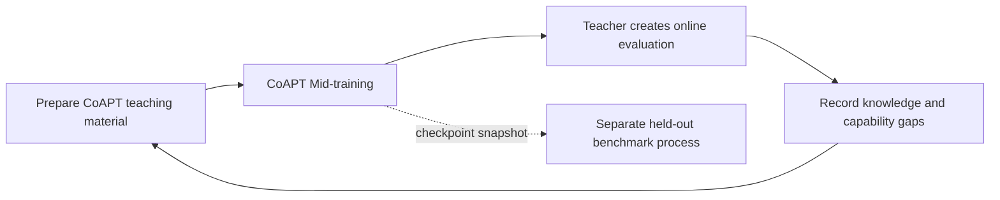

# Nekaise Studio

Design updated after user direction — 2026-09-14. Initial draft discussed with Claude Code (Fable 5.1).

A framework for improving a small language model by adapting training to its measured
weaknesses. The original lineage starts with `openbmb/MiniCPM5-1B-Base`. A separate
`openbmb/MiniCPM5-1B-SFT` campaign uses its native single-turn no-thinking interface and
fresh optimizer, preserving Base history for teacher-led comparison. These are explicit
starting-point choices, not a prescribed CPT/SFT training sequence.
Two separate roles use coding-agent transports: the teacher (default GPT-5.6 Terra)
teaches and diagnoses; the orchestrator (default GPT-6 Astra) handles interruptions and
repairs execution. A simple supervisor schedules workers and availability retries. Codex
and Claude Code are implemented transports; OpenCode remains an extension. Training tools
perform the weight updates. `rounds=-1` means continuous learning. Quota exhaustion is
a normal wait; other faults wake the orchestrator after training is quiescent.
The orchestrator decides how to recover, including when to validate, continue, wait or
pause. Host validation results return to it as evidence for its next decision. Preserve
reports of its investigation, repairs, observations and decisions.
It also reviews run history and training logs, decides what to keep, archive or clean up,
and leaves reports and useful log summaries. Routine reviews happen between completed
rounds at an interval it selects. Archived teaching history remains accessible.
Studio is the default homepage, with training usage and teacher-assessment charts. The
Report tab presents operational status and decisions. The orchestrator also reads
the report archive and makes operational decisions without a user approval step. Agent
waits and pauses schedule its next review; explicit user pause/stop remains an override.

**CoAPT Mid-training** is this project's unified name for **CPT + SFT** and the current
development focus. Unless qualified, training means this shared path; CPT and SFT are
distinguished only within recipes, material composition and provenance. **CoAPT
Post-training** is the collective name for the planned **RL + OPD** mechanisms. Their
concrete implementation is deferred. See [the terminology contract](docs/COAPT.md#project-terminology-and-current-scope).

Build the persistent loop first: each round consumes a checkpoint and previous evaluation,
then produces training material, a candidate checkpoint, and evidence for the next round.
At bootstrap, choose a representative starting sample and let the teacher create an
initial assessment of the base student. A fixed benchmark is not required to start the loop. The teacher has full educational
authority and access to all teaching history; it chooses both the curriculum and how
much of that history to consult. The executable teaching contract is [docs/COAPT.md](docs/COAPT.md).

1. **Prepare CoAPT Mid-training material.** The teacher
   consults all teaching history, selects sources from the eligible, cleaned corpus or
   authors its own tasks, observes the student's attempts, and writes corrected teaching
   text. It decides which examples enter training, the raw reading/review material,
   token shares and dataset passes. Preserve sources, decisions and actual attempts.
   No second semantic validation overrides the teacher.

   The student drafts explanations or answers teacher-authored questions, with context
   chosen by the teacher. Corrections become teaching material in the shared recipe;
   the student's mistakes inform the next lesson. The teacher can also choose
   reading-only, review-only or diagnostic rounds.

2. **Run CoAPT Mid-training.** Freeze the combined dataset and train from the retained
   checkpoint under a recorded recipe and budget. Mix targeted lessons,
   broader corpus coverage, and previous material to limit forgetting. Save checkpoint lineage.

3. **Create an online evaluation and diagnose.** After training, the teacher generates
   that round's evaluation from the learning goals, lessons, and previous gaps. Prepare
   reference answers and scoring rules before collecting student answers.
   Test taught concepts with new questions, revisit weaknesses, and probe related material
   outside that round's lessons. Use executable checks where possible and teacher assessment
   for open-ended responses. The teacher chooses how much assessment to do, including
   deferring it, and how to classify learning needs. Save the evaluation, actual answers,
   judgments and durable teaching notes.

4. **Feed the findings into the next dataset.** Map weaknesses back to corpus passages
   and prepare new CoAPT lessons. Confusion about heat-transfer units should lead to
   relevant explanations and exercises. Record selection reasons. Normally continue from
   the new checkpoint; any retry or rollback uses recorded training failures or online
   evaluation evidence. Always use the retained student's measured gaps.
   Knowledge failures call for corpus lessons; tool-use failures call for task practice.

**Online evaluation belongs to the learning loop.** Its findings directly shape the next
dataset and task curriculum. Because each round's questions can change, raw scores across
rounds are not directly comparable; the teacher can test the previous and new checkpoints
on the same freshly generated evaluation when a comparison is useful. These evaluations
are development feedback, and diagnosed concepts can become future lessons.

**Held-out benchmarking belongs to a separate process, deferred from the initial build.**
That process receives immutable student checkpoints and owns benchmark data, isolation,
scoring, and reports to the project owner. Its questions, answers, and results do not feed
the teaching agent, curriculum, or automatic checkpoint decisions. It owns any source and
duplicate exclusions needed to preserve its holdout, without exposing test content. The
training loop can complete rounds without invoking or waiting for it.

Readable instructions, round files, and CLI tools let another agent resume the loop.
Persist stage progress, selection rationale, teaching records, dataset and checkpoint
identities, evaluations, gap profiles, and checkpoint decisions.

## Future: CoAPT Post-training

CoAPT Post-training groups RL and OPD under the same outer teaching loop. The extension
notes below preserve design ideas, not implemented capabilities or a required training
sequence. Current work remains focused on Mid-training; post-training recipes and
supporting trajectory infrastructure are deferred.

To train **agentic reasoning**, the student itself must practice planning, using tools,
checking results, and recovering from errors. Begin with short, verifiable domain tasks:
find parameters in a document, calculate heat transfer, and check units. Give it a
bounded environment with document search/read and a calculator or Python tool, following
the interaction pattern explored by [ReAct](https://arxiv.org/abs/2210.03629).
Grounding now includes source passages, actual tool outputs, and executable checks.

- **Teach through trajectories.** Bootstrap the tool protocol with verified demonstrations,
  then let the student attempt tasks. Record short plans, actions, observations, and results.
  At a state the student reached, the teacher corrects the next decision or action.
  Execute corrected actions and let the student resume. Use a versioned environment
  snapshot and regenerate observations; an edited action cannot inherit old results.
  SFT learns verified corrections, with prompts, observations, and earlier erroneous
  actions masked from the loss. Those errors may remain as context for learning recovery.
- **Candidate OPD recipe within Post-training.** Within training, repeatedly sample fresh trajectories
  from the current student, ask a frozen teacher scorer for token probabilities on those
  exact student prefixes, update the student, and sample again. A candidate recipe uses
  sampled reverse KL, `KL(student || teacher)`, with a policy-gradient update on
  assistant-generated tokens. Tool observations are conditioning context. This supplies
  feedback along the student's own path; rewritten teacher answers belong to the SFT
  path. [GKD](https://arxiv.org/abs/2306.13649) describes on-policy distribution matching;
  [Thinking Machines](https://thinkingmachines.ai/blog/on-policy-distillation/) gives
  the sampled-token reverse-KL recipe.
- **Provide the right scorer.** The coding agent can remain the task author and editor,
  while a separate local or hosted model scores trajectories. Initially require a shared
  tokenizer and probabilities for supplied student tokens; using different tokenizers
  would require a validated alignment method. Agent CLI text replies alone do not
  provide that interface. Score the actual student history; declare any additional
  training-source evidence given to the teacher. Exclude future tool results and
  benchmark answers. Validate the scorer on domain tasks. Log each rollout's checkpoint
  and maximum staleness in update steps.
- **Evaluate autonomous execution.** Run the student without teacher intervention under
  fixed tool, step, and token budgets. Measure verified task completion, valid tool use,
  recovery, and knowledge retention on tasks created online by the teacher, with references
  fixed before execution. Teacher likelihood is a learning signal; task checks establish
  correctness. Longer reasoning text is not a success metric. Feed diagnosed failures
  into new tasks and lessons. Independent benchmark tasks stay in the separate process.

The outer loop stays the same: the teacher chooses what to teach, with CoAPT Post-training
as a future training path. Extend the saved artifacts with environment
versions, trajectories, scoring-model identity, and validation results.

This adapts the [preserved studio CoAPT description](docs/reference/COAPT-upstream-2026-09-14.md) using the existing
[corpus](../nekaise-corpus/README.md). The current studio combines prose and QA supervision
in CoAPT Mid-training. CoAPT Post-training and role-aware trajectory support are proposed
additions, with adaptive diagnostics driving the next curriculum.

Focus now on CoAPT Mid-training and demonstrate complete rounds with online teacher
evaluations that change the next curriculum. CoAPT Post-training is future work. Later,
the separate benchmark process can compare its recipes with continued Mid-training at
matched total budgets, including teacher scoring and student rollout costs. Improved
knowledge or agentic ability in a 1B student remains an experimental question.

### Required expansion and efficiency (2026-09-18)

Positive training requires Material Author expansion and teacher-selected expanded targets.
Diagnostic rounds may preserve weights without expansion. Teacher content/review authority
remains intact. The default `required_v1` policy supersedes earlier optional-delegation advice;
legacy artifacts stay readable. Studio displays measured training tokens / primary Teacher
tokens, with per-round observations and a smoothed trend. The same usage feedback reaches
curriculum and reflection. See [the contract](docs/COAPT.md#training-production-efficiency).
