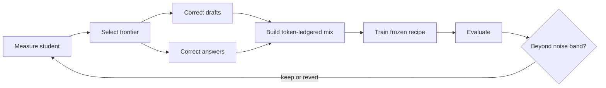

# nekaise-studio

_An [OpenNekaise](https://github.com/OpenNekaise) project._

An agent-operated fine-tuning platform for language models under 8B parameters. Current campaigns
focus on building-energy knowledge, grounded in real corpus text and designed to produce models
that can run on-premises through
[nekaise-edge](https://github.com/OpenNekaise/nekaise-edge).

The coding agent builds the data, trains the student, measures the result, and keeps or reverts the
change. Humans define the experimental contract and review what the evidence supports.

## Start

Clone the repository, open it in Claude Code or Codex, and let the agent read
[`AGENTS.md`](AGENTS.md) and [`STATUS.md`](STATUS.md).

```bash
git clone --depth 1 https://github.com/OpenNekaise/nekaise-studio.git
cd nekaise-studio
python tools/doctor.py
```

The doctor checks the GPU, pinned environments, local configuration, corpus, and evaluation
holdout. Fix every reported problem before training begins.

Keep generated work outside the maintained repository:

```bash
python -m studio.cli workspace init ../nekaise-user-workspace
python -m studio.cli --workspace ../nekaise-user-workspace integrity
```

The workspace can also be selected with `NEKAISE_WORKSPACE`. See
[`docs/WORKSPACE.md`](docs/WORKSPACE.md) for the isolation and promotion model.

## CoAPT

Studio trains through **Co-Adaptive Pretraining and Tuning**. The current student's measured state
selects what it needs to learn next. The agent teaches only from source documents, the student is
trained with a frozen recipe, and an independent referee decides whether the result is worth
keeping.



The loop has two teaching branches:

- **Adaptive CPT** — the student drafts over a corpus chunk; the agent rewrites it into textbook
  prose supported only by that chunk.
- **Personalized SFT** — the agent asks questions from a document, the student answers closed-book,
  and the agent corrects the answer using only that document.

Raw corpus text, corrected prose, question-and-answer text, and an anchor stream become one
token-ledgered training mix. Checkpoints chain across rounds. The changed student is measured again,
which changes the next frontier and closes the loop.

The trainer is intentionally fixed: one full-parameter CPT recipe. Complexity belongs in the data,
gates, verifiers, and measurement—not in an expanding collection of training tricks.

## Experimental contract

Studio separates teaching from judgment. The agent may shape the training data, but it never grades
the exam that decides whether a model improved.

- The corpus is the only source of truth. Unsupported teacher knowledge never enters training.
- Evaluation tasks, verifiers, pools, and frozen splits do not change within a campaign.
- The training recipe stays fixed across rounds; only the student and student-conditioned data
  change.
- Keep/revert decisions must clear a measured noise band without regressing the transfer guardrail.
- Effectiveness claims must beat equal-compute raw-corpus CPT.
- Runs, datasets, and checkpoints have permanent identities and immutable provenance.

The binding contract lives in [`SPEC.md`](SPEC.md). Changing it—or any frozen configuration—is a
human-reviewed decision, never an automatic loop move.

## Studio, gym, and workspace

**Studio contains the gym; the gym never contains Studio.** The gym is the examination hall: tasks,
deterministic verifiers, and the model runner. It contains no training code, hyperparameters,
experiment logs, or weights. Studio is the workshop that trains a model against that independent
referee. [`BOUNDARY.md`](BOUNDARY.md) defines the complete contract.

The repository itself is a maintained bootloader. Mutable state belongs in a user workspace.

| Layer | Contains |
|---|---|
| **Bootloader** | Core skills, frozen configs, referee, stages, guardrails, and CLI. |
| **Workspace** | Round data, runs, checkpoints, private data, overrides, scratch files, and local skills. |

Validated findings can become local skills; stale or contradictory findings are pruned. A local
skill enters the shared bootloader only after surviving evaluation and human review.

## Repository map

| Path | Role |
|---|---|
| [`AGENTS.md`](AGENTS.md) | Complete operating instructions for coding agents. |
| [`STATUS.md`](STATUS.md) | Current campaign, measured state, and next action. |
| [`SPEC.md`](SPEC.md) | CoAPT constitution, ban list, null hypothesis, and environment lock. |
| [`BOUNDARY.md`](BOUNDARY.md) | Bidirectional Studio/gym containment contract. |
| `skills/` | CoAPT conductor, teaching branches, and self-improvement procedures. |
| `studio/` | JSON CLI, training stages, decisions, and workspace machinery. |
| `gym/` | Tasks, deterministic verifiers, and model runner. |
| `configs/` | Frozen stage configurations and CoAPT round recipe. |
| `experiments/` | Data builders and campaign-specific recipes. |
| `lib/` | Run, artifact, dataset, logging, and model plumbing. |
| `tools/` | Preflight, student inference, evaluation, and privacy tools. |
| `tests/` | CPU-only guardrails for fixed contracts. |

The live campaign is always described in [`STATUS.md`](STATUS.md). Durable behavior belongs in the
specification, boundary, skills, and code—not in this README.

## License

`nekaise-studio` is MIT licensed. It is one project in the wider
[OpenNekaise ecosystem](https://github.com/orgs/OpenNekaise/repositories).
