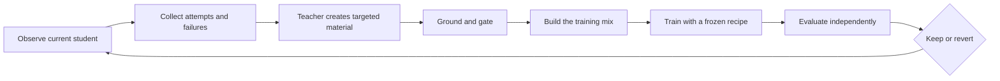

# Co-Adaptive Pretraining and Tuning

**Co-Adaptive Pretraining and Tuning**, or **CoAPT**, is a student-conditioned teaching framework. A teacher observes what a particular student can currently do, then uses the student's attempts, errors, partial successes, and blind spots to create the training material that student should see next.

That is the central idea. The material is not prepared for an abstract model. It is prepared in response to this model, at this point in its development.

Grounding keeps the loop honest. In Studio's current knowledge campaign, lessons are grounded in corpus documents. A future agentic campaign could instead ground lessons in verified tasks, tool results, execution traces, and environment state. The grounding source may change; the rule does not: the teacher cannot turn unsupported intuition into training truth.

In compact form:

```text
Dᵣ = f(Sᵣ, evidence, teacher)
```

The dataset for round `r` depends on the student at round `r`, the evidence available to teach from, and the teacher that converts observed behavior into useful examples.

> The student supplies the signal. The teacher turns that signal into curriculum. Grounding supplies the truth.

This page describes the wider idea and its current implementation in Nekaise Studio. [SPEC.md](../SPEC.md) remains the binding definition for the active campaign. Agentic training is a future direction and requires its own human-reviewed specification before activation.

## Why make training co-adaptive?

Most training pipelines prepare data independently of the model that will consume it. Every student receives essentially the same curriculum, even when their capabilities and failures are different. More data or more repetitions can strengthen that curriculum, but they do not make it responsive.

CoAPT closes the feedback loop:

1. Observe the current student doing real work.
2. Identify what it understands, where it fails, and how it fails.
3. Have a teacher create targeted material from those observations.
4. Ground and gate every lesson against trusted evidence.
5. Train, evaluate independently, and observe the changed student again.

The teacher does more than supply an ideal answer. It uses the student's behavior as an input to teaching. A confused continuation calls for a different lesson than a nearly correct one. A wrong tool choice calls for a different example than a correct plan with a failed recovery. As the student changes, the useful lesson changes too.

Without the student's response, this would be ordinary teacher-generated data. CoAPT begins when the student's present ability changes the lesson the teacher creates.

CoAPT therefore combines five properties:

- **Student-conditioned teaching.** Attempts and failures help determine both what is taught and how it is expressed.
- **Grounded generation.** Teacher material must be supported by a document, verifier, tool result, or other campaign-approved evidence.
- **Between-round adaptation.** The curriculum changes after measurement, while each individual training run remains reproducible.
- **Independent evaluation.** The teacher that writes lessons does not write or grade the exam.
- **Measured recursion.** A new student is retained only when the effect clears the campaign's noise threshold and guardrails.

## Five roles, kept separate

| Role | Responsibility |
|---|---|
| **Grounding source** | Defines what may be taught: corpus text today; verified tasks and outcomes in a future agentic campaign. |
| **Student** | Produces the attempts, failures, and partial successes that reveal its present frontier. |
| **Teacher** | Converts those observations into targeted, grounded training material. |
| **Trainer** | Applies the campaign's frozen optimization recipe to the completed material. |
| **Referee** | Measures the result on frozen tasks the teacher cannot alter or inspect while teaching. |

These boundaries are part of the method. The student does not decide what is true. The teacher does not decide whether its teaching worked. The trainer does not search for a more favorable recipe between rounds.

## The loop



One round follows the same general sequence:

1. **Observe.** Ask the current student to continue text, answer questions, solve tasks, or perform workflows appropriate to the campaign.
2. **Diagnose.** Turn its outputs and measurements into a picture of its present capabilities.
3. **Select.** Choose the knowledge, behavior, or task frontier worth teaching next.
4. **Teach.** Create examples that directly address the observed mistakes and omissions.
5. **Ground and gate.** Reject unsupported claims, invalid trajectories, leakage, and malformed examples.
6. **Train.** Apply the campaign's frozen training recipe to an immutable, recorded dataset.
7. **Judge.** Measure the result with an independent, frozen referee.
8. **Repeat.** If retained, the new checkpoint becomes the next student and produces a new set of observations.

The adaptation boundary is deliberately narrow:

| Changes each round | Stays fixed within a campaign |
|---|---|
| Student checkpoint and measured behavior | Grounding and evaluation boundaries |
| Selected knowledge or task frontier | Selection policy |
| Student attempts and trajectories | Teacher instructions, formats, and gates |
| Teacher-created training examples | Data recipe and training recipe |
| Next checkpoint | Referee and decision rules |

This is how CoAPT can be recursive without becoming uncontrolled. The content responds to the student; the rules of the experiment do not.

## Current implementation: learning from text

Studio's active campaign applies CoAPT to knowledge acquisition from technical documents. The corpus is the grounding source and the only source of truth. The student is measured with per-document language-model loss and closed-book probes. The least-absorbed documents are selected first by probe accuracy, with higher NLL breaking ties.

The teacher then uses the student's behavior to create material through two complementary branches.

### Adaptive CPT

```text
source passage → student continuation → source-grounded correction
```

The student drafts a continuation from a selected passage. Its draft exposes confused terms, invented facts, wrong values, and missing relationships. The teacher preserves what is useful and repairs what is wrong, using only the passage.

```text
d → rₛ → T(d, rₛ) → d̃
```

Here `d` is the source passage, `rₛ` is the student's response, and `d̃` is the grounded teaching text. The source decides what is true; the student's draft decides what needs emphasis.

### Personalized SFT

```text
source passage → teacher question → closed-book student answer → source-grounded correction
```

The teacher writes a question answerable from the passage. The student answers without seeing it. The answer reveals what the student can retrieve and use, not merely what text it can continue. The teacher then corrects the answer against the source.

```text
d → qₜ → aₛ → T(d, qₜ, aₛ) → a*
```

Here `qₜ` is the grounded question, `aₛ` is the student's closed-book answer, and `a*` is the correction. The verified pair is serialized as ordinary `Question:` / `Answer:` text into the same continued-pretraining stream.

The two branches address different aspects of learning: Adaptive CPT improves acquisition of domain language and relationships; Personalized SFT practices using that knowledge when prompted.

### One training mix

| Stream | Purpose |
|---|---|
| **Raw corpus** | Preserves direct exposure to selected documents and their natural technical distribution. |
| **Teacher CPT** | Concentrates on mistakes and omissions revealed by student continuations. |
| **QA as text** | Rehearses closed-book use of knowledge the student could not retrieve reliably. |
| **Anchor** | Maintains broader corpus coverage and reduces over-specialization on the current frontier. |

CoAPT is not a pure synthetic-data diet. Teacher material is corrective; raw and anchor text keep it connected to the underlying domain. A token ledger records realized content tokens rather than rows, because examples of different lengths can make row-level ratios misleading.

## Beyond text: agentic work

The same teaching pattern can extend to agentic capabilities. Instead of asking only whether the student knows a fact, a campaign can observe whether it can plan, call tools, inspect results, recover from errors, and complete a longer workflow.

```text
verified task → student trajectory → teacher diagnosis → grounded correction or demonstration
```

The student's trajectory becomes teaching context. The teacher can see where the plan diverged, which tool was misused, which observation was ignored, or where recovery stopped. It then creates training material aimed at that specific failure: a corrected trajectory, a contrastive example, a recovery demonstration, or a task at the next appropriate level.

Grounding remains essential. A future agentic teacher cannot simply claim that a workflow succeeded. Tool outputs, environment state, deterministic checks, and task verifiers must establish what actually happened. The referee remains separate from the teacher, and the task set, gates, recipe, and decision rule remain frozen within the campaign.

Agentic CoAPT is not active in the current Studio campaign. Introducing it requires a new algorithm card that defines its evidence boundary, trajectory format, gates, trainer, referee, and matched control. The general framework anticipates that direction; the current specification does not silently authorize it.

## Co-adaptation is not scaling

Scaling asks what happens when a model receives more tokens, more repetitions, or more training time. Co-adaptation asks what the next training experiences should contain after observing the current student. A larger static run can strengthen any curriculum, but it does not create feedback.

This distinction defines the fair comparison. An effectiveness claim must beat a matched baseline with the same trainer and compute or token budget. In the current text campaign, the null arm rereads the same frontier documents as raw text at the exact volume spent by the corrective streams, with the anchor share held constant. The experiment changes the information in the training diet, not the amount of training.

## Why the trainer stays frozen

CoAPT adapts the training **material**, not the optimization recipe. Learning rate, schedule, batch construction, token budget, and other campaign settings are fixed before the baseline round.

If the trainer changes alongside the curriculum, an improvement cannot be attributed to co-adaptation. A frozen recipe prevents the loop from becoming automated hyperparameter search and keeps comparisons meaningful. The intelligence belongs in observation, diagnosis, grounded teaching, and gating. The trainer should be intentionally boring.

## Teaching and judging are separate

The teacher is allowed to shape training material, so it cannot be the final authority on whether that material worked. CoAPT uses a separate, deterministic referee with frozen evaluation tasks.

This prevents a subtle form of self-confirmation: a teacher can create examples that resemble its preferred answers and then appear successful when asked to judge them. Studio keeps the exam fixed and outside the teaching process, then records enough provenance to reproduce every decision.

The grounding source defines what can be taught. The referee defines whether the campaign should keep the result.

## What counts as success

CoAPT separates three claims that are easy to blur together.

**Loop closure** means training changes the student, the changed student produces different measurements or behavior, and those observations change the next training material. In the current text campaign, teacher-text NLL must fall, old questions must be answered better, and frontier turnover is reported.

**Learning** means the campaign's primary capability metric improves beyond the baseline noise band while independent guardrails remain intact. For the current campaign, those are pool absorption and corpus transfer.

**Effectiveness** is the stronger claim: CoAPT must outperform the matched non-adaptive baseline. A functioning two-round loop can establish loop closure; it cannot by itself prove that CoAPT is better than ordinary continued pretraining or static task training.

Loss and perplexity are useful diagnostic signals, not final success metrics. The campaign must show usable capability under independent evaluation.

## Why Nekaise Studio uses it

Nekaise Studio is built for small, on-premises models that need both specialized knowledge and dependable behavior. In that setting, CoAPT offers a practical balance:

- It spends teacher and training compute on observed gaps rather than replaying a fixed curriculum indefinitely.
- It makes the student's actual behavior part of data creation instead of treating the student as a passive consumer.
- It supports different grounding sources while keeping truth and evaluation boundaries explicit.
- It preserves broader capability with anchor material and campaign guardrails.
- It makes recursive improvement auditable through immutable data, checkpoints, gates, ledgers, trajectories, and evaluation reports.
- It allows a campaign to stop, keep, or revert based on evidence rather than momentum.

The aim is broader than corpus absorption and more disciplined than imitation. It is a student that receives increasingly relevant teaching as its capabilities evolve, while every lesson and every claim of progress remains grounded and testable.

## What CoAPT is not

CoAPT is not a teacher dumping everything it knows into a smaller model. It is not a fixed synthetic dataset, self-grading distillation, live hyperparameter search, or an excuse to change the experiment whenever a score is disappointing.

The current campaign is also not reinforcement learning, PPO, DPO, MCTS, or dynamic within-run sampling. Future agentic work does not inherit permission to use those methods; its specification must define its own controlled training mechanism.

## From concept to implementation

- [SPEC.md](../SPEC.md) — the binding protocol for the active text campaign
- [STATUS.md](../STATUS.md) — the current campaign state and next action
- [CoAPT round](../skills/coapt-round.md) — the complete current round procedure
- [Adaptive CPT](../skills/coapt-cpt.md) — the continuation-teaching branch
- [Personalized SFT](../skills/coapt-sft.md) — the question-and-answer branch
- [CoAPT configuration](../configs/coapt.yaml) — current campaign settings and frozen controls
- [Run store](RUNSTORE.md) — artifact identity, immutability, and provenance
