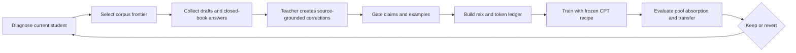

# CoAPT

**CoAPT**, Co-Adaptive Pretraining and Tuning, adapts training data to the current student. A teacher observes what a particular model can do, then uses its attempts, errors, and omissions to create source-grounded material for that student.

The method spans continued pretraining, or mid-training, and SFT. **The implemented workflow is text-only:** Adaptive CPT produces corrected prose; Personalized SFT produces question-and-answer pairs serialized into the same CPT stream. Both branches, the token ledger, frozen training recipe, independent referee, and equal-token raw-corpus control are implemented. Current campaigns focus on CPT.

Agentic CoAPT, trajectory correction, dense teacher scoring, and on-policy distillation as an inner training mechanism are proposals. They are outside the current [algorithm card](../SPEC.md). An agent operating the training system does not mean the student is being trained to operate tools.

In compact form:

```text
Dᵣ = f(Sᵣ, evidence, teacher)
```

The dataset for round `r` depends on the student at that round, the available evidence, and the teacher. In the current implementation, that evidence is real corpus text.

> The student supplies the signal. The teacher turns that signal into curriculum. Grounding supplies the truth.

## Where CoAPT sits in the training stack

“Pretraining” in the name means continued pretraining of an existing student. “Tuning” refers to the question-and-answer branch, which practices using knowledge when prompted.

| Stage | Relationship to the implemented workflow |
|---|---|
| **Pre-training** | Provides the starting student. |
| **Mid-training** | Adaptive CPT turns source passages and student continuations into grounded teaching prose. |
| **SFT** | Personalized SFT creates corrected question-and-answer examples, trained as plain text alongside the prose. |

These are purposes and data forms within one causal language-model training stream. The branch named Personalized SFT does not invoke a separate chat-format trainer. Chat-format SFT consolidation is deferred, and agentic RL remains future work.

The intended combination is knowledge acquisition and utilization. Whether either branch improves those capabilities is an evaluation question, not a consequence of its name.

## Why make training co-adaptive?

A fixed curriculum cannot respond to differences between students or to changes in the same student. CoAPT asks whether observations of the current model can make the next training material more useful.

The teacher does more than supply an ideal answer. A confused continuation may need an explanation of a relationship; a nearly correct answer may need one missing qualification. The source determines what can be said, while the student's response helps determine what needs emphasis.

The intended feedback loop is straightforward: measure the student, teach against its observed gaps, train, and measure again. The round workflow is implemented, but repeated adaptation must still be demonstrated in a completed campaign. Generating useful material from one student checkpoint establishes only part of that claim.

## On-policy in what sense?

> CoAPT uses on-policy contexts with teacher-corrected targets.

Here, “on-policy contexts” describes **data creation from a snapshot of the current student**. The student generates drafts and closed-book answers. Those attempts become context for the teacher's corrections.

The teacher can rewrite an attempt substantially, so the final training sequence need not preserve the student's token history. The attempt is diagnostic input; only accepted teaching material enters training.

Training then runs offline on the completed, immutable dataset. Student outputs are not resampled after every update, and the trainer does not optimize teacher probabilities on student-generated tokens. The phrase therefore describes student-conditioned supervision, not a claim that the implemented loss is strict on-policy distillation.

## Five roles, kept separate

| Role | Responsibility today |
|---|---|
| **Grounding source** | Corpus text defines which claims may enter training. |
| **Student** | Produces attempts and measurements that expose its present gaps. |
| **Teacher** | Creates and gates source-grounded corrections and questions. |
| **Trainer** | Applies the frozen CPT recipe to the completed mix. |
| **Referee** | Measures the result with fixed probes and deterministic verifiers. |

The student does not decide what is true. The teacher's judgment can gate a lesson or supply an advisory diagnosis, but it cannot supply the keep/revert score. The trainer cannot search for more favorable settings between rounds.

## The loop



This diagram describes the implemented round protocol and its intended repetition. It is not evidence that the multi-round loop has already closed.

Diagnosis combines per-document negative log-likelihood, or NLL, with closed-book pool probe measurements. The frozen selection rule chooses a frontier from the campaign's fixed pool. Both teaching branches work from that frontier, and accepted rows become an immutable dataset.

A retained checkpoint supplies the next round's student. Before creating more data, the protocol checks whether the student assigns lower NLL to prior teacher text, answers prior questions better, and changes which documents occupy the frontier. The first two are required closure checks; frontier turnover is reported. These signals test the mechanism, while the independent capability metrics govern keep/revert.

The operational sequence lives in [the round skill](../skills/coapt-round.md). [STATUS.md](../STATUS.md) identifies the active campaign and any owner-approved departure from the original rollout plan.

## CoAPT for learning from text

The corpus is the only source of truth. Every training row must trace to a source document. A fact absent from that source cannot enter a teacher correction, even if the teacher knows it is true.

### Adaptive CPT

```text
d → rₛ → T(d, rₛ) → d̃
```

The student drafts over a selected source passage `d`. Its response `rₛ` exposes confused terms, invented facts, wrong values, or missing relationships. The teacher uses only that passage to produce corrected textbook prose `d̃`.

The source decides what is supported; the draft helps decide what to explain. Corrections are gated claim by claim before admission. The procedure is implemented in [the Adaptive CPT skill](../skills/coapt-cpt.md).

### Personalized SFT

```text
d → qₜ → aₛ → T(d, qₜ, aₛ) → a*
```

The teacher writes a question `qₜ` answerable from the source. The student answers closed-book, producing `aₛ`, and the teacher corrects that answer against the source to obtain `a*`. This probes retrieval under a question rather than continuation from a visible passage.

The verified pair is serialized as plain `Question:/Answer:` text into the same CPT stream. **Training uses full-token loss, with no loss masking:** the question and answer both contribute to the language-model objective.

This branch is implemented in [the Personalized SFT skill](../skills/coapt-sft.md). The reported CPT pilot did not include QA text, so its result does not validate the combined branches or establish a separate SFT gain.

### One training mix

The general text recipe combines four streams:

| Stream | Purpose |
|---|---|
| **Raw corpus** | Direct exposure to selected source documents. |
| **Teacher CPT** | Grounded prose responding to student mistakes and omissions. |
| **QA as text** | Practice answering source-backed questions. |
| **Anchor** | Broader corpus exposure beyond the selected frontier. |

A token ledger records realized content tokens by stream. Row counts would conceal differences in example length and could make nominal mix shares misleading. Round artifacts preserve source references, student attempts, teacher rows, gate verdicts, and the ledger so the dataset's construction can be audited.

Campaigns declare their mix before training. The retained CPT comparison uses teacher composition and anchor text, without the general recipe's QA stream. Anchor material is intended to limit over-specialization; its presence does not guarantee preservation of other capabilities.

## Why the trainer stays frozen

CoAPT adapts data content between rounds. Within a campaign, mix shares, prompts, templates, gates, the pool, frontier selection rules, token budget, and training settings remain fixed. There is no dynamic difficulty filtering or example reweighting inside a training run.

In `configs/coapt.yaml`, only `data.round`, `data.round_dir`, `run.init_from`, and `run.seed` change between rounds. Checkpoints chain, so later rounds continue from the preceding student.

Changing a recipe starts a new campaign under the repository's change discipline. Changing [SPEC.md](../SPEC.md) or a frozen training configuration requires human review. A disappointing result does not authorize the loop to loosen a gate or alter the optimizer.

These constraints make the experiment interpretable: the material responds to the student while the rules used to produce and train it remain stable.

## Teaching and judging are separate

Training-data gates answer whether a lesson is supported and admissible. The referee answers whether the trained student improved. Those are different decisions.

The loop metric is `coapt_pool_absorption_dev`, measured on a pool frozen at campaign start. It measures absorption of corpus material eligible for training. It is not an unseen-document generalization score.

The no-regression guardrail is `corpus_transfer_macro_dev`. Transfer and frozen milestone documents are excluded from every training stream. Probe questions and reference answers are not teaching material; the agent reaches the referee through `tools/eval_probes.py`, without opening the probe bank.

Milestone referees are reserved for phase gates under the protocol. They are not targets for repeated curriculum tuning. Evaluation artifacts are never regenerated within a campaign.

Independent scoring and fixed artifacts constrain self-confirmation, but do not make repeated development-set use immune to overfitting. Claims must stay within the evaluation actually performed.

## Co-adaptation is not scaling

More tokens or repetitions can improve a model without any feedback-driven curriculum. A gain over the untrained student therefore cannot establish CoAPT's effectiveness.

The required control is **equal-token raw-corpus CPT**, using the same trainer and total content-token budget. The retained pilot also matches source spans and anchor material across arms. This tests whether teacher composition adds value beyond reading the corresponding raw text.

Equal training tokens do not mean equal total cost: student diagnosis, teacher generation, and gating also consume resources. A quality gain under this control is not automatically an efficiency gain.

The CPT scale ladder asks how the comparison changes after more raw-corpus training. Reusing a fixed teacher dataset at later checkpoints does not demonstrate that a changed student selected and received a new curriculum.

## What counts as success

**Loop closure** means training changes the student, those changes appear in fresh measurements, and the measurements change the next round's data. Lower loss alone cannot establish the full chain.

**Learning** means the loop capability metric improves beyond the measured noise band while the transfer guardrail passes. NLL, draft quality, prior-question accuracy, and training loss remain diagnostic signals. Perplexity is never a success metric.

**Effectiveness** requires outperforming equal-token raw-corpus CPT. A functioning loop and an advantage over that control are separate claims; neither proves the other.

The retained pilot on a **1B student** found a **small gain over equal-token raw CPT on a corpus-derived pool, with the transfer guardrail passing**. This supports a bounded claim about the tested CPT recipe. It does not establish broad superiority across topics, larger models, or agentic capabilities.

The campaign record also includes the CPT scale ladder, where the outcome depends on the checkpoint and guardrail. The planned two-round MVP never ran, and **multi-round loop closure is not yet demonstrated**. See [STATUS.md](../STATUS.md) for the current evidence, limitations, and next actions.

## Beyond text: proposed agentic work

**This section describes future work, outside the implemented text loop.** Reinforcement learning with verifiable rewards (RLVR), on-policy distillation (OPD), and the agentic stage were retired from the algorithm card. Restoring any of them requires a human-reviewed spec change.

An agentic extension could observe plans, tool calls, execution results, and recovery from errors. Its grounding would require verified task and environment evidence, rather than corpus text alone. That broader evidence contract would need to be specified before training.

Thinking Machines Lab's [on-policy distillation post](https://thinkingmachines.ai/blog/on-policy-distillation/) describes sampling student trajectories, obtaining teacher log probabilities for those sampled tokens, and training with a per-token reverse-KL signal. This is a possible inner mechanism for a future CoAPT design, not a mechanism currently available in this repository's training loop.

Other proposed mechanisms include correcting trajectories from states the student actually visited and using dense teacher scoring to guide updates. Their data formats, gates, training objectives, and controls remain to be defined for CoAPT.

Teacher preference would still not prove task success. Tool results, environment state, and independent verifiers would need to establish what happened. These proposals retain the motivating question: can teaching that responds to the current student's behavior improve learning? The implemented text workflow is where that question is being tested today.
