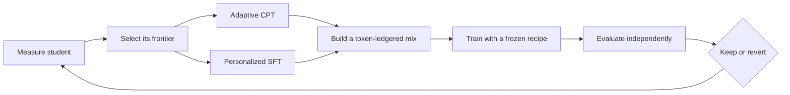

# Co-Adaptive Pretraining and Tuning

Co-Adaptive Pretraining and Tuning, or **CoAPT**, is a corpus-grounded training loop in which a model helps reveal what it should learn next.

Ordinary continued pretraining usually chooses a dataset once, then trains over it. CoAPT closes the loop:

> Measure the current student, find the edge of its knowledge, teach from trusted sources, train, evaluate independently, then measure the new student again.

The student changes after every round, so the next training set changes with it. This is the co-adaptive part: the model and its curriculum evolve together.

In compact form:

```text
Dᵣ = f(Sᵣ, corpus, teacher)
```

The dataset for round `r` is a function of the student at round `r`. Change the student, repeat the measurements, and the selected documents, drafts, answers, and corrections can change too.

This page explains the idea and why Nekaise Studio uses it. [SPEC.md](../SPEC.md) remains the binding technical definition.

## Why CoAPT

Static training data treats every model as if it had the same gaps. A document that is valuable to one student may be redundant for another; a concept learned last round may still occupy the same share of the next dataset. More tokens do not necessarily mean more useful learning.

CoAPT is designed around a different question:

> Given this student, this corpus, and this compute budget, which grounded examples are most likely to move the frontier now?

That framing matters for small, domain-focused models. Teacher inference and GPU time are limited. Training should concentrate on demonstrated weaknesses while preserving broad domain ability, and every claimed improvement should remain traceable to source material and reproducible artifacts.

CoAPT therefore combines five ideas:

- **Student-conditioned selection.** The current checkpoint helps determine the next round's curriculum.
- **Corpus-grounded teaching.** Teacher corrections and answers must be supported by the selected source.
- **A frozen trainer.** The training recipe stays fixed so a round tests the data loop, not a moving collection of hyperparameters.
- **Independent evaluation.** The system that produces training data does not write or grade its own exam.
- **Measured recursion.** A round is kept only when its effect is larger than the established noise band and its guardrails remain intact.

## Five roles, kept separate

| Role | Responsibility |
|---|---|
| **Corpus** | Defines what may be taught and provides provenance for every training claim. |
| **Student** | Reveals what it has and has not absorbed, then becomes the next round's starting point. |
| **Teacher** | Turns observed gaps into better examples, bounded by the selected source. |
| **Trainer** | Applies one frozen continued-pretraining recipe to the completed mix. |
| **Referee** | Measures the result on frozen tasks the teacher cannot alter or inspect while teaching. |

These boundaries are part of the method. The student does not decide what is true, the teacher does not decide whether training succeeded, and the trainer does not search for a better recipe between rounds.

## The loop



Each round follows the same sequence:

1. **Measure.** Score the current student on frozen corpus chunks and closed-book diagnostic questions.
2. **Select.** Rank the least-absorbed documents first by closed-book probe accuracy, then prioritize the highest-NLL documents within a tie.
3. **Teach.** Turn selected source passages into corrective training examples through two complementary branches.
4. **Gate.** Reject unsupported claims, source mismatches, malformed examples, and leakage.
5. **Mix.** Combine raw corpus text, teacher-produced continuations, question-and-answer text, and anchor material under an explicit token ledger.
6. **Train.** Run the same continued-pretraining recipe used by every round in the campaign.
7. **Judge.** Evaluate with frozen, independent metrics and compare the effect with the campaign's noise band.
8. **Re-select.** If the round is retained, the resulting checkpoint becomes the next student and reveals a new frontier.

Selection happens between rounds, never dynamically inside a training run. That makes every dataset immutable, inspectable, and reproducible.

The adaptation boundary is deliberately narrow:

| Changes each round | Stays fixed within a campaign |
|---|---|
| Student checkpoint and measured state | Candidate pool and evaluation splits |
| Frontier documents | Selection rule |
| Student drafts and closed-book answers | Teaching prompts, formats, and gates |
| Source-grounded corrections | Mix shares and token budget |
| Next checkpoint | Trainer and referee |

This is why CoAPT can be recursive without becoming uncontrolled. The content responds to the student; the rules of the experiment do not.

## Two ways of teaching

CoAPT uses two branches because knowledge has two useful forms: acquiring the structure and language of domain material, and using that knowledge reliably when prompted.

### Adaptive CPT

```text
source passage → student continuation → source-grounded correction
```

The student drafts a continuation from a selected corpus passage. The teacher sees the passage and the draft, then produces a better continuation using only information supported by that source.

This branch targets the student's local modeling errors while preserving the natural texture of technical writing. It produces continued-pretraining text rather than chat-shaped instruction data.

Formally:

```text
d → rₛ → T(d, rₛ) → d̃
```

where `d` is a source passage, `rₛ` is the student's response, and `d̃` is the grounded teaching text.

### Personalized SFT

```text
source passage → teacher question → closed-book student answer → source-grounded correction
```

The teacher writes a question answerable from the passage. The student answers without seeing the source. The teacher then corrects the answer against the source, and the verified pair is serialized as ordinary `Question:` / `Answer:` text into the same continued-pretraining mix.

This branch exposes knowledge the student cannot retrieve reliably, even when its next-token loss looks acceptable.

Formally:

```text
d → qₜ → aₛ → T(d, qₜ, aₛ) → a*
```

where `qₜ` is a source-grounded question, `aₛ` is the student's closed-book answer, and `a*` is the corrected answer.

The two branches share the same truth boundary: the corpus passage. The teacher may reorganize, clarify, or correct what is present; it may not import unsupported knowledge.

## Why one mix has four streams

Both branches ultimately train through the same causal-language-model objective. Question-and-answer pairs are serialized as ordinary `Question:` / `Answer:` text, not sent through a separate chat-tuning stage.

| Stream | Purpose |
|---|---|
| **Raw corpus** | Preserves direct exposure to the selected documents and their natural technical distribution. |
| **Teacher CPT** | Concentrates on mistakes and omissions revealed by student continuations. |
| **QA as text** | Rehearses closed-book use of knowledge the student could not retrieve reliably. |
| **Anchor** | Maintains broader corpus coverage and reduces over-specialization on the current frontier. |

CoAPT is therefore not a pure synthetic-data diet. The teacher material is corrective; raw and anchor text keep it connected to the underlying corpus. The ledger measures realized **content tokens**, rather than rows, because examples of different lengths can make row-level ratios misleading.

## Co-adaptation is not scaling

Scaling asks what happens when a model receives more tokens, more repetitions, or more training time. Co-adaptation asks what the next tokens should contain after observing the current student. A larger static run can strengthen any curriculum, but it does not create the feedback loop.

That distinction also defines the fair control. CoAPT must be compared with raw-corpus continued pretraining that uses the same trainer and the same total content-token budget. In Studio's null arm, the same frontier documents are reread as raw text at the exact volume spent by the corrective streams, while the anchor share remains matched. The experiment changes the information in the training diet, not the amount of training.

## Why the trainer stays frozen

CoAPT adapts the **data**, not the optimization recipe. Learning rate, schedule, batch construction, token budget, and other campaign settings are fixed before the baseline round.

This separation makes results interpretable. If the trainer changes alongside the curriculum, an improvement cannot be attributed to co-adaptation. A frozen recipe also prevents the loop from quietly becoming automated hyperparameter search and makes round-to-round comparisons meaningful.

The intelligence belongs in diagnosis, selection, grounded teaching, and gating. The trainer should be intentionally boring.

## Teaching and judging are separate

The teacher is allowed to shape training data, so it cannot be the final authority on whether that data worked. CoAPT uses a separate, deterministic referee with frozen evaluation splits.

The separation protects against a subtle failure mode: a teacher can generate examples that resemble its preferred answers and then appear successful when asked to grade them. Studio instead keeps the exam fixed, keeps it out of training, and records enough evidence to reproduce each decision.

The corpus is the only source of truth for teaching. The referee is the source of truth for campaign decisions.

## What counts as success

CoAPT distinguishes three claims that are easy to blur together.

**Loop closure** means the machinery responds to the student. Teacher-text loss falls, previously missed diagnostic questions improve, and the selected frontier changes in the following round.

**Learning** means the primary pool-absorption metric improves by more than the baseline noise band while the independent corpus-transfer guardrail remains intact.

**Effectiveness** is the stronger claim. CoAPT must outperform an equal-compute, equal-token raw-corpus continued-pretraining control. A functioning two-round loop can establish loop closure; it cannot, by itself, prove that CoAPT is better than ordinary continued pretraining.

Perplexity alone is not success. It is useful for diagnosis, but the campaign must show retained, transferable knowledge under independent evaluation.

## Why Nekaise Studio uses it

Nekaise Studio is built for small, on-premises models trained on specialized corpora. In that setting, CoAPT offers a practical balance:

- It spends teacher and training compute on observed gaps rather than replaying a fixed curriculum indefinitely.
- It keeps every teaching claim anchored to a reproducible corpus source.
- It preserves broad capability with raw and anchor data instead of optimizing only for the current frontier.
- It makes recursive improvement auditable through immutable datasets, checkpoints, token ledgers, gates, and evaluation reports.
- It allows the campaign to stop, keep, or revert based on evidence rather than momentum.

The goal is not a model that merely imitates a larger teacher. It is a model that absorbs more of its own trusted corpus, round by round, without losing what it already knows.

## A small example

Suppose the student struggles with a corpus passage about an HVAC control sequence.

The diagnostic stage identifies that passage as frontier material. In the Adaptive CPT branch, the student attempts a continuation and the teacher repairs omissions or contradictions using only the passage. In the Personalized SFT branch, the teacher asks a question grounded in the same passage, the student answers closed-book, and the teacher supplies a supported correction.

After gating, those examples enter a token-budgeted mix with raw corpus and anchor material. The frozen trainer produces the next checkpoint. The independent referee then tests whether the relevant knowledge became more accessible without degrading performance elsewhere. If retained, the new checkpoint is measured again; material it now handles well should give way to a different frontier.

That changing frontier is CoAPT in motion.

## What CoAPT is not

CoAPT is not reinforcement learning, PPO, DPO, MCTS, or live hyperparameter search. It does not let the teacher supply free-floating knowledge, grade its own exam, regenerate the evaluator between rounds, or alter sampling during a training run.

It is a controlled data curriculum around an ordinary, frozen continued-pretraining trainer.

## From concept to implementation

- [SPEC.md](../SPEC.md) — the binding protocol and invariants
- [STATUS.md](../STATUS.md) — the current campaign state and next action
- [CoAPT round](../skills/coapt-round.md) — the complete round procedure
- [Adaptive CPT](../skills/coapt-cpt.md) — the continuation-teaching branch
- [Personalized SFT](../skills/coapt-sft.md) — the question-and-answer branch
- [CoAPT configuration](../configs/coapt.yaml) — campaign settings and frozen controls
- [Run store](RUNSTORE.md) — artifact identity, immutability, and provenance
