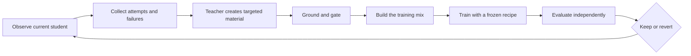

# Co-Adaptive Pretraining and Tuning

**Co-Adaptive Pretraining and Tuning**, or **CoAPT**, is a student-conditioned teaching framework. A teacher observes what a particular student can currently do, then uses the student's attempts, errors, partial successes, and blind spots to create the training material that student should see next.

That is the central idea. The material is not prepared for an abstract model. It is prepared in response to this model, at this point in its development.

Grounding keeps the loop honest. For knowledge learning, lessons can be grounded in corpus documents. For agentic work, they can be grounded in verified tasks, tool results, execution traces, and environment state. The grounding source may change; the rule does not: the teacher cannot turn unsupported intuition into training truth.

In compact form:

```text
Dᵣ = f(Sᵣ, evidence, teacher)
```

The dataset for round `r` depends on the student at round `r`, the evidence available to teach from, and the teacher that converts observed behavior into useful examples.

> The student supplies the signal. The teacher turns that signal into curriculum. Grounding supplies the truth.

CoAPT is defined by this relationship, not by a particular data type, training stage, or optimizer. The sections below show how the same teaching loop applies to both knowledge and agentic behavior.

## Where CoAPT sits in the training stack

Expert performance usually combines several layers: understanding the input, retrieving relevant knowledge, choosing a plan, and executing it reliably. A useful [training-stack view](https://thinkingmachines.ai/blog/on-policy-distillation/) develops those layers across three broad stages:

| Stage | Purpose | Relationship to CoAPT |
|---|---|---|
| **Pre-training** | General language, reasoning, and world knowledge | Usually provides the starting student. |
| **Mid-training** | Specialized knowledge from code, documents, databases, or another domain source | CoAPT selects knowledge at the student's frontier and turns its mistakes into grounded teaching text. |
| **Post-training** | Targeted behavior such as instruction following, reasoning, tool use, and workflow execution | CoAPT elicits the student's behavior and teaches directly against the failures it observes. |

CoAPT focuses on the latter two stages and connects them. Mid-training gives the model something worth knowing; post-training makes that knowledge usable in the behavior we want. Both can draw their material from the same student-conditioned loop.

The distinction is about purpose, not necessarily separate training jobs. A CoAPT implementation can place corrected prose and question-and-answer text in one causal-language-model stream while the two forms still serve mid-training and post-training functions.

## Why make training co-adaptive?

Most training pipelines prepare data independently of the model that will consume it. Every student receives essentially the same curriculum, even when their capabilities and failures are different. More data or more repetitions can strengthen that curriculum, but they do not make it responsive.

CoAPT closes the feedback loop:

1. Observe the current student doing real work.
2. Identify what it understands, where it fails, and how it fails.
3. Have a teacher create targeted material from those observations.
4. Ground and gate every lesson against trusted evidence.
5. Train, evaluate independently, and observe the changed student again.

The teacher does more than supply an ideal answer. It uses the student's behavior as an input to teaching. A confused continuation calls for a different lesson than a nearly correct one. A wrong tool choice calls for a different example than a correct plan with a failed recovery. As the student changes, the useful lesson changes too.

Without the student's response, this would be ordinary teacher-generated data. CoAPT begins when the student's present ability changes the lesson the teacher creates.

CoAPT therefore combines five properties:

- **Student-conditioned teaching.** Attempts and failures help determine both what is taught and how it is expressed.
- **Grounded generation.** Teacher material must be supported by a document, verifier, tool result, or other accepted evidence.
- **Policy-relative experience.** Training material comes from behavior the current student actually produces, whether refreshed between rounds or sampled on-policy during training.
- **Independent evaluation.** The teacher that writes lessons does not write or grade the exam.
- **Measured recursion.** A new student is retained only when the effect clears evaluation thresholds and guardrails defined in advance.

## On-policy in what sense?

CoAPT begins data creation from the current student's own behavior:

```text
student attempt x ~ πₛ
teaching material m = Gate(T(evidence, x))
new student S′ = Train(S, m)
```

The attempt may be a continuation, an answer, a plan, a tool call, or a complete trajectory. Because `x` comes from the current student policy, the teacher sees the states and mistakes this student actually produces. Because `m` is created by the teacher and must be grounded in evidence, the learning signal can be much denser than a final success/failure reward. The raw mistake remains diagnostic context; only gated teaching material enters training.

The concise description is:

> CoAPT uses on-policy contexts with teacher-corrected targets.

This places CoAPT between familiar approaches:

| Approach | Experience comes from | Teaching signal |
|---|---|---|
| **Off-policy SFT or distillation** | Teacher demonstrations prepared independently of the student | Dense target output |
| **Reinforcement learning** | Student rollouts | Usually a sparse outcome reward |
| **Strict on-policy distillation** | Student rollouts | Dense teacher scores on the student's own tokens or actions |
| **CoAPT** | Student attempts or trajectories | Grounded teacher revisions, dense scores, or both |

The current student is therefore part of data generation, not merely the recipient of a teacher dataset. But CoAPT does not require every implementation to perform online reward optimization. Text-oriented CoAPT can freeze a student checkpoint, generate its drafts and answers, have a teacher revise them, build an immutable dataset, and then train offline. Agentic CoAPT can use a tighter on-policy loop with dense teacher scoring. What remains constant is that the student's behavior changes the teaching material.

## Five roles, kept separate

| Role | Responsibility |
|---|---|
| **Grounding source** | Defines what may be taught: corpus text for knowledge; verified tasks and outcomes for agentic behavior. |
| **Student** | Produces the attempts, failures, and partial successes that reveal its present frontier. |
| **Teacher** | Converts those observations into targeted, grounded training material. |
| **Trainer** | Applies a declared optimization recipe to the completed material. |
| **Referee** | Measures the result on frozen tasks the teacher cannot alter or inspect while teaching. |

These boundaries are part of the method. The student does not decide what is true. The teacher does not decide whether its teaching worked. The trainer does not search for a more favorable recipe between rounds.

## The loop



One round follows the same general sequence:

1. **Observe.** Ask the current student to continue text, answer questions, solve tasks, or perform workflows appropriate to the capability being taught.
2. **Diagnose.** Turn its outputs and measurements into a picture of its present capabilities.
3. **Select.** Choose the knowledge, behavior, or task frontier worth teaching next.
4. **Teach.** Create examples that directly address the observed mistakes and omissions.
5. **Ground and gate.** Reject unsupported claims, invalid trajectories, leakage, and malformed examples.
6. **Train.** Apply a declared training recipe to immutable, recorded material.
7. **Judge.** Measure the result with an independent, frozen referee.
8. **Repeat.** If retained, the new checkpoint becomes the next student and produces a new set of observations.

The adaptation boundary is deliberately narrow:

| Changes each round | Stays fixed for a controlled comparison |
|---|---|
| Student checkpoint and measured behavior | Grounding and evaluation boundaries |
| Selected knowledge or task frontier | Selection policy |
| Student attempts and trajectories | Teacher instructions, formats, and gates |
| Teacher-created training examples | Data recipe and training recipe |
| Next checkpoint | Referee and decision rules |

This is how CoAPT can be recursive without becoming uncontrolled. The content responds to the student; the rules of the experiment do not.

## CoAPT for learning from text

When CoAPT is used for knowledge acquisition, the corpus is the grounding source and the source of truth. The student's state can be measured with signals such as per-document language-model loss and closed-book probes. A selection policy identifies the least-absorbed documents and forms the next knowledge frontier.

The teacher then uses the student's behavior to create material through two complementary branches.

### Adaptive CPT

```text
source passage → student continuation → source-grounded correction
```

The student drafts a continuation from a selected passage. Its draft exposes confused terms, invented facts, wrong values, and missing relationships. The teacher preserves what is useful and repairs what is wrong, using only the passage.

```text
d → rₛ → T(d, rₛ) → d̃
```

Here `d` is the source passage, `rₛ` is the student's response, and `d̃` is the grounded teaching text. The source decides what is true; the student's draft decides what needs emphasis.

### Personalized SFT

```text
source passage → teacher question → closed-book student answer → source-grounded correction
```

The teacher writes a question answerable from the passage. The student answers without seeing it. The answer reveals what the student can retrieve and use, not merely what text it can continue. The teacher then corrects the answer against the source.

```text
d → qₜ → aₛ → T(d, qₜ, aₛ) → a*
```

Here `qₜ` is the grounded question, `aₛ` is the student's closed-book answer, and `a*` is the correction. The verified pair is serialized as ordinary `Question:` / `Answer:` text into the same continued-pretraining stream.

The two branches address different aspects of learning: Adaptive CPT improves acquisition of domain language and relationships; Personalized SFT practices using that knowledge when prompted.

### One training mix

| Stream | Purpose |
|---|---|
| **Raw corpus** | Preserves direct exposure to selected documents and their natural technical distribution. |
| **Teacher CPT** | Concentrates on mistakes and omissions revealed by student continuations. |
| **QA as text** | Rehearses closed-book use of knowledge the student could not retrieve reliably. |
| **Anchor** | Maintains broader corpus coverage and reduces over-specialization on the current frontier. |

CoAPT is not a pure synthetic-data diet. Teacher material is corrective; raw and anchor text keep it connected to the underlying domain. A token ledger records realized content tokens rather than rows, because examples of different lengths can make row-level ratios misleading.

## Beyond text: agentic work

The same teaching pattern extends to agentic capabilities. Instead of asking only whether the student knows a fact, CoAPT can observe whether it can plan, call tools, inspect results, recover from errors, and complete a longer workflow.

Long workflows make student-conditioned teaching especially important. A dataset of flawless teacher trajectories shows states the teacher tends to visit. But a smaller student will make different early decisions and arrive in states the teacher demonstrations never covered. Errors then compound: the student most needs help precisely where an off-policy dataset has the least to say.

### Learning where the student actually goes

[On-policy distillation](https://thinkingmachines.ai/blog/on-policy-distillation/) offers a useful mechanism for this part of CoAPT. It combines the student-visited states of reinforcement learning with the dense supervision of distillation.

The article's specific implementation samples trajectories from the student, asks the teacher for token probabilities on those same trajectories, and trains with a per-token reverse-KL signal. The teacher therefore responds to the context the student actually created—even after an imperfect step—instead of supplying only a separate ideal solution. This reduces exposure mismatch and gives much denser credit than a single success or failure at the end.

That relationship is close to CoAPT's central idea: the student's present behavior changes the teaching it receives.

```text
verified task → student trajectory τₛ
              → teacher feedback on student-visited states
              + environment verdict
              → targeted update → new student
```

For agentic CoAPT, the teacher signal can take more than one form:

- **Corrected trajectories.** Continue from the student's state, repair the plan or tool use, and create a grounded demonstration of recovery.
- **Contrastive material.** Preserve a useful student step while showing why a nearby action fails and which observation should change the decision.
- **Dense distillation.** Score the student's own tokens or actions under a stronger teacher and train toward the teacher on those visited states.
- **Next-frontier tasks.** Use the observed trajectory to create a task that isolates the missing capability without jumping far beyond the student's reach.

### Teacher guidance is not ground truth

On-policy distillation supplies a dense behavioral target, but teacher probability does not prove that an action is correct or that a workflow succeeded. A confident teacher can still be wrong, misuse a tool, or prefer a style that does not satisfy the task.

Agentic CoAPT therefore needs two distinct signals:

1. **Teacher guidance** explains what to do differently at the states the student visited.
2. **Verified outcomes** establish what actually happened through tool results, environment state, deterministic checks, and task verifiers.

The first makes supervision dense. The second keeps it grounded. A sequence-level environment verdict can also catch failures that token-level imitation cannot. The independent referee remains outside both the lesson-generation process and the training objective used for keep/revert decisions.

On-policy distillation is consequently a promising inner training mechanism for agentic CoAPT, not the definition of CoAPT itself. CoAPT is the wider controlled loop: observe the student, create policy-relative teaching, ground it, train, judge independently, and repeat.

## Co-adaptation is not scaling

Scaling asks what happens when a model receives more tokens, more repetitions, or more training time. Co-adaptation asks what the next training experiences should contain after observing the current student. A larger static run can strengthen any curriculum, but it does not create feedback.

This distinction defines the fair comparison. An effectiveness claim must beat a matched non-adaptive baseline with the same trainer and compute or token budget. For text learning, that baseline can reread the selected documents as raw text. For agentic work, it can use a fixed set of teacher demonstrations. The comparison changes whether teaching responds to the student, not the amount of training.

## Why the trainer stays frozen

CoAPT adapts the training **material**, not the optimization recipe. Learning rate, schedule, batch construction, token budget, and other settings remain fixed during a controlled comparison.

If the trainer changes alongside the curriculum, an improvement cannot be attributed to co-adaptation. A frozen recipe prevents the loop from becoming automated hyperparameter search and keeps comparisons meaningful. The intelligence belongs in observation, diagnosis, grounded teaching, and gating. The trainer should be intentionally boring.

## Teaching and judging are separate

The teacher is allowed to shape training material, so it cannot be the final authority on whether that material worked. CoAPT uses a separate, deterministic referee with frozen evaluation tasks.

This prevents a subtle form of self-confirmation: a teacher can create examples that resemble its preferred answers and then appear successful when asked to judge them. CoAPT keeps the exam fixed and outside the teaching process, then records enough provenance to reproduce every decision.

The grounding source defines what can be taught. The referee defines whether the new student should be retained.

## What counts as success

CoAPT separates three claims that are easy to blur together.

**Loop closure** means training changes the student, the changed student produces different measurements or behavior, and those observations change the next training material. Text learning can measure teacher-text NLL, old-question accuracy, and frontier turnover; agentic learning can measure recovery, tool use, and task completion.

**Learning** means the primary capability metric improves beyond the baseline noise band while independent guardrails remain intact.

**Effectiveness** is the stronger claim: CoAPT must outperform the matched non-adaptive baseline. A functioning two-round loop can establish loop closure; it cannot by itself prove that CoAPT is better than ordinary continued pretraining or static task training.

Loss and perplexity are useful diagnostic signals, not final success metrics. The method must show usable capability under independent evaluation.

## Why use CoAPT

CoAPT is especially useful for smaller or specialized models that need both focused knowledge and dependable behavior:

- It spends teacher and training compute on observed gaps rather than replaying a fixed curriculum indefinitely.
- It makes the student's actual behavior part of data creation instead of treating the student as a passive consumer.
- It supports different grounding sources while keeping truth and evaluation boundaries explicit.
- It preserves broader capability with anchor material and evaluation guardrails.
- It makes recursive improvement auditable through immutable data, checkpoints, gates, ledgers, trajectories, and evaluation reports.
- It allows each iteration to stop, keep, or revert based on evidence rather than momentum.

The aim is broader than corpus absorption and more disciplined than imitation. It is a student that receives increasingly relevant teaching as its capabilities evolve, while every lesson and every claim of progress remains grounded and testable.

## What CoAPT is not

CoAPT is not a teacher dumping everything it knows into a smaller model. It is not a fixed synthetic dataset, self-grading distillation, live hyperparameter search, or an excuse to change the experiment whenever a score is disappointing.

CoAPT is also not defined by CPT, SFT, reinforcement learning, or distillation. Those are possible inner training mechanisms. The defining feature is the outer relationship: the student's behavior shapes the teacher's material, the material is grounded, and an independent referee measures what changed.
